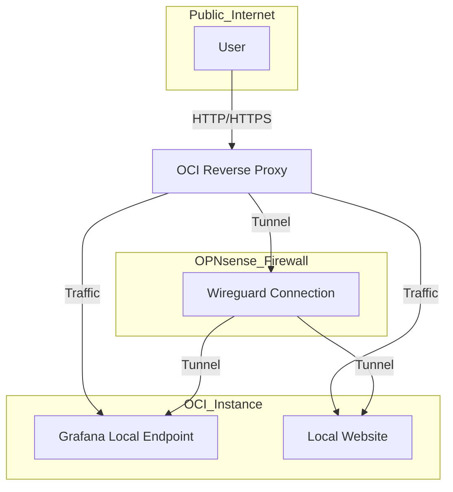

```mermaid
graph TD
    subgraph OCI_Instance
        direction TB
        Grafana_Local_Endpoint[Grafana Local Endpoint]
        Local_Website[Local Website]
    end

    subgraph OPNsense_Firewall
        direction TB
        Wireguard_Connection[Wireguard Connection]
    end

    subgraph Public_Internet
        direction TB
        User[User]
    end

    User -->|HTTP/HTTPS| Reverse_Proxy[OCI Reverse Proxy]
    Reverse_Proxy -->|Traffic| Grafana_Local_Endpoint
    Reverse_Proxy -->|Traffic| Local_Website
    Reverse_Proxy -->|Tunnel| Wireguard_Connection
    Wireguard_Connection -->|Tunnel| Grafana_Local_Endpoint
    Wireguard_Connection -->|Tunnel| Local_Website
```