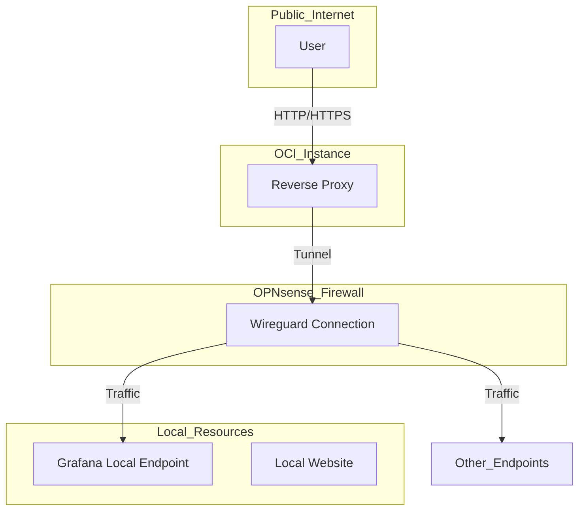

```mermaid
graph TD
    subgraph Public_Internet
        direction TB
        User[User]
    end

    subgraph OCI_Instance
        direction TB
        Reverse_Proxy[Reverse Proxy]
    end

    subgraph OPNsense_Firewall
        direction TB
        Wireguard_Connection[Wireguard Connection]
    end

    subgraph Local_Resources
        direction TB
        Grafana[Grafana Local Endpoint]
        Local_Website[Local Website]
    end

    User -->|HTTP/HTTPS| Reverse_Proxy
    Reverse_Proxy -->|Tunnel| Wireguard_Connection
    Wireguard_Connection -->|Traffic| Grafana
    Wireguard_Connection -->|Traffic| Other_Endpoints
```

## Security Benefits

 - Mask your local IP Address
 - Restrict access of the connection via firewall rules.
 - Crowdsec to detect bad actors and threats.